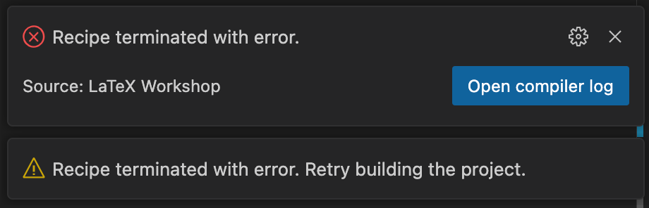

# 卒論 / 修論テンプレート

原田研究室向けの卒論・修論テンプレートです。

## インストール / 使い方

### レポジトリのクローン

```shell
git clone git@github.com:mil-tokyo/mil-thesis-template.git
```

### Latexのインストール

```shell
which latex
```

上のコマンドでパスが表示される場合は、スキップしてください。そうでない場合は、Mac で brew を用いる場合は以下のコマンドでインストールできます。

```shell
brew install mactex-no-gui --cask
```

> [!TIP]
> MacTeX のインストールには50分くらい時間がかかります。

途中でPasswordを聞かれるので、ログインしているPCのアカウントのパスワードを入力してください。

以下が表示されれば成功です。
```
==> mactex-no-gui
You must restart your terminal window for the installation of MacTeX CLI
tools to take effect.

Alternatively, Bash and Zsh users can run the command:

  eval "$(/usr/libexec/path_helper)"
```

ターミナルを再起動するか、
```shell
eval "$(/usr/libexec/path_helper)"
```
を実行してください。
`which latex`でインストールの確認ができます。

### Latex Workshopのインストール

VSCode の拡張機能である [Latex Workshop](<https://marketplace.visualstudio.com/items?itemName=James-Yu.latex-workshop>) をインストールします。


## 便利なショートカット

|            動作             |   ショートカットキー   | 選択ファイル |
| :-------------------------: | :--------------------: | :----------: |
|        ビューワ起動         | `Command + Option + V` |     .tex     |
|           ビルド            |     `Command + S`      |     .tex     |
|          TeX → PDF          | `Command + Option + J` |     .tex     |
|          PDF → TeX          |  `Command + 左クリック`  |     .pdf     |
|        フォーマット         | `Option + Shift + F` |     .tex     |
|  文字の折り返しの切り替え   |      `Option + Z`      |     .tex     |
| `out/` 以下のファイルの削除 | `Command + Option + C` |      .tex       |

## 困ったとき

### ビルドの途中でエラーが発生する

`out/thesis.log` にエラーメッセージが書かれています。ファイル内検索などで `error` などを探すとよいです。



#### latexmkが見えない
ターミナルで`which latexmk`と打ってlatexmkが入っていることが確認できても、
 `Recipe terminated with fatal error: spawn latexmk ENOENT.`
というエラーが出ることがあります。

これはなんらかの問題でターミナルが参照しているパスとLaTeX Workshopが参照しているパスが異なってしまっているために発生します。
多くの場合は以下の方法でcodeというものをインストールして、ターミナルからVSCodeを開くことにより解決します。

1. VSCodeで`Command + Shift + P`を押してコマンドパレットを開く
2. 検索バーで`code`と入力
3. 「シェルコマンド:PATH内に’code’コマンドをインストールします」をクリックし、インストールを行う（管理者権限が必要なため、途中でパスワードを求められます）
4. VSCodeを閉じ、Mac標準のターミナルでLaTeXテンプレートのディレクトリに遷移し、以下を実行
```shell
code .
```

参考：https://github.com/James-Yu/LaTeX-Workshop/issues/1414

### フォーマッティングが失敗する

"Formatting failed. Please refer to LaTeX Workshop Output for details." などのメッセージが出る場合は、いっそのこと `latexindent` を入れ直すとよいです。

```shell
brew install latexindent
```

### 図表の作成ツール

図の作成に [draw.io](<https://www.drawio.com/>) や PowerPoint を利用する方が多いようです。図は PDF 形式での保存が推奨されます。表の作成には [Tables Generator](<https://www.tablesgenerator.com/latex_tables>) が便利です。

### 表紙の差し替えかた

表紙に指導教員の印をもらった後に、PDFにスキャンして差し替えます。

詳しくは #TODO

### 概要ページの入れかた

一ページ二段組みの概要ページを表紙の直後に入れます。

詳しくは #TODO

## 参考資料

- 先輩方の卒論・修論 [[asari](<http://asari:8888/unagi0/ankou/share/ResearchArchive/>)]
- 参考文献の書き方 (by 牛久先生) [[URL](<https://yoshitakaushiku.net/how_to_write_references.html>)]
- 2023 Latex環境構築会 [[資料](<https://docs.google.com/document/d/14Y9dF1dKIn-MpgElpyFpq5NYBlWXfJGCnAwvLG3X5gI>)] [[録画](<https://drive.google.com/drive/folders/1AZZTUUxA8X3r3HcI86xG-ist_jptz2C1>)]

### 過去のテンプレート

- 2014年までのテンプレート(?) [[asari](<http://asari:8888/unagi0/ankou/share/kuniyoshi/isitex_template/>)]
- 2015年からのテンプレート [[asari](<http://asari:8888/unagi0/ankou/share/ResearchArchive/templates/>)]

## Thanks

- 渡邊 諒 (2024/03 修士修了)： テンプレートの作成
